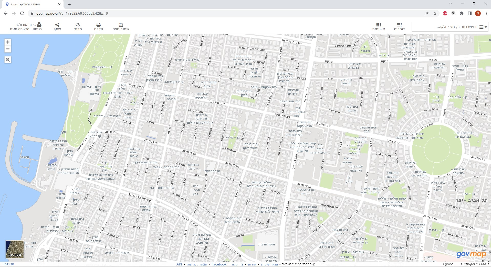

# real_estate_sales_data_scrapping

This script enable the user to scrap sales history data from govmap site.

This site has access to history data of sales from the Ministry of Justice database. 

The site is a GIS system of Israel and in this script we will take advantage
of the map display to focus on a specific area of interest from the map.

An end user can do the same in the govmap website but what distinguish this script is that we will get all the data in an easy digest excel spreadsheet.

## Run from the terminal

```
git clone https://github.com/nirgalili/real_estate_sales_data_scrapping.git
python3 <code path>\real_estate_sales_data_scrapping\main.py 
```

## Usage/Examples

To operate this program you will have to respond to prompt from the IDE run window.
You will follow a request to go to govmap site and manually collect data.
See the following screenshots on how to do it:

The steps are:

1. go to govmap site https://www.govmap.gov.il/


2. Browse the map to find a place of interest. Here for example old north in Tel Aviv.



3. Highlight real estate deals layer.


4. In application menu go to regional analysis.


5. Create polygon on area of interest real estate.


6. After table with info of latest deals open press F12.


7. Copy the class "realsestate-items-wrapper table-mode scrollWrapper"


8. Create txt file with the copied text.


9. Save the file in the project path.


## License

[MIT](https://choosealicense.com/licenses/mit/)